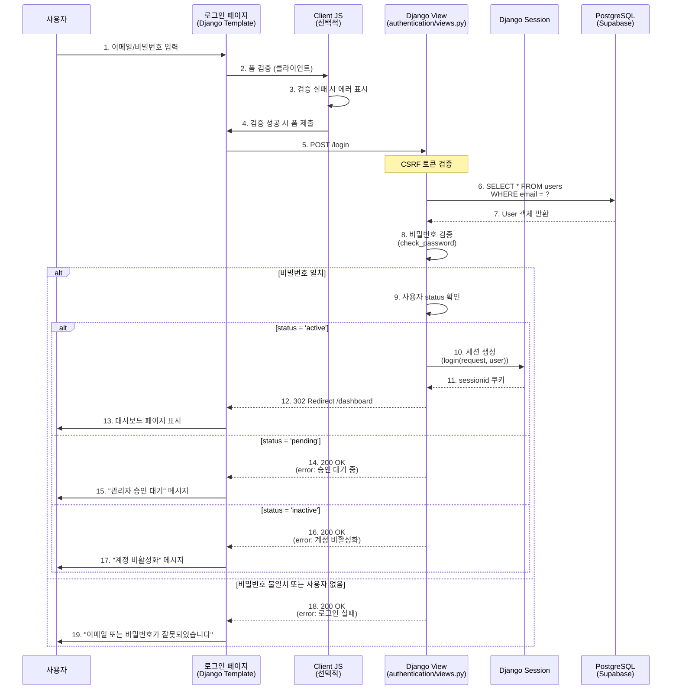
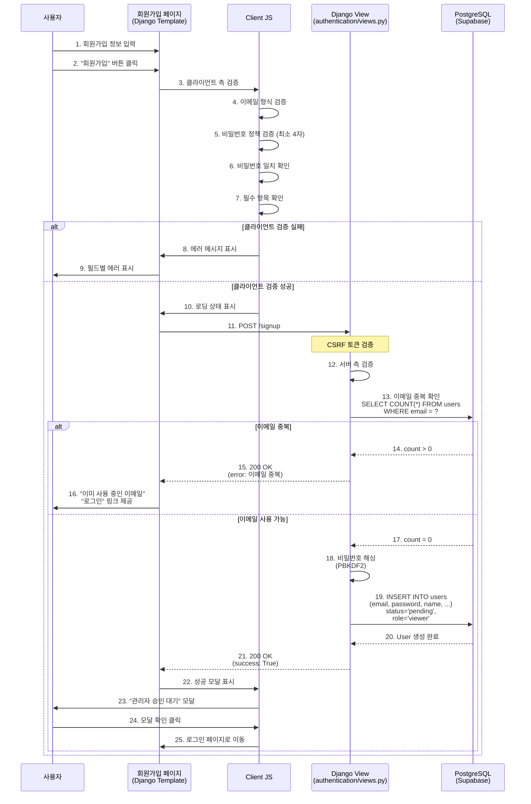
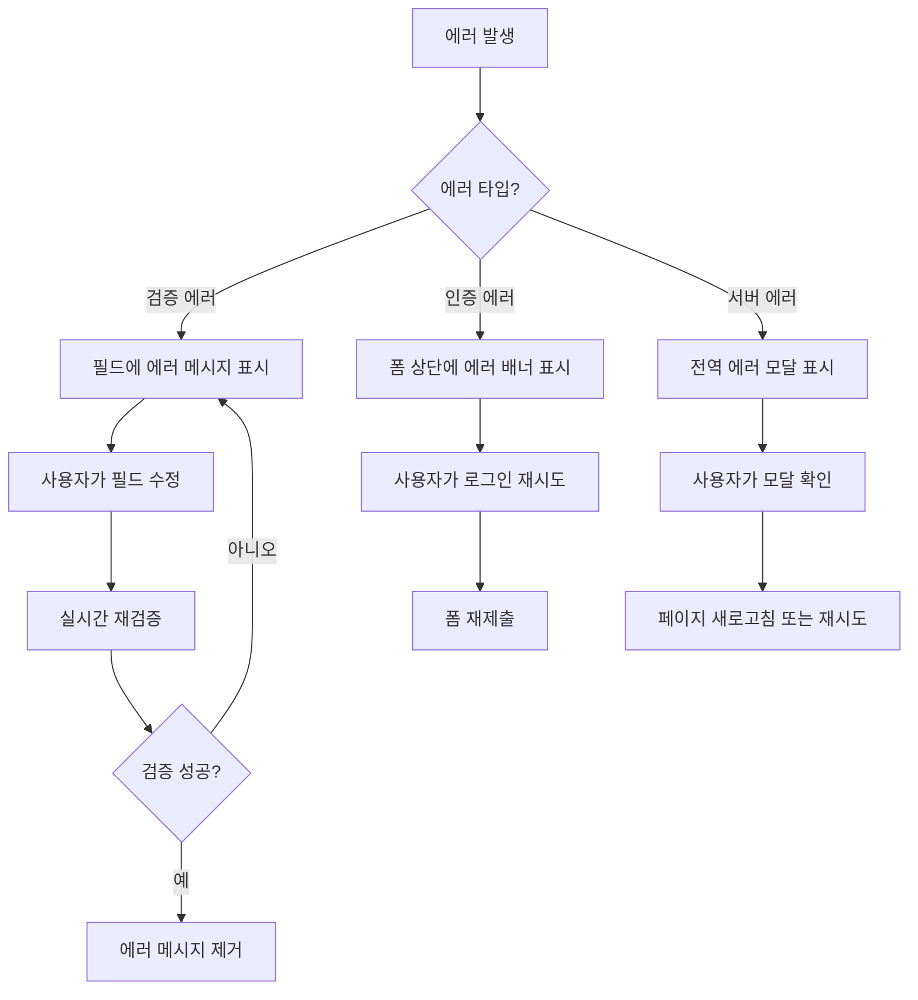
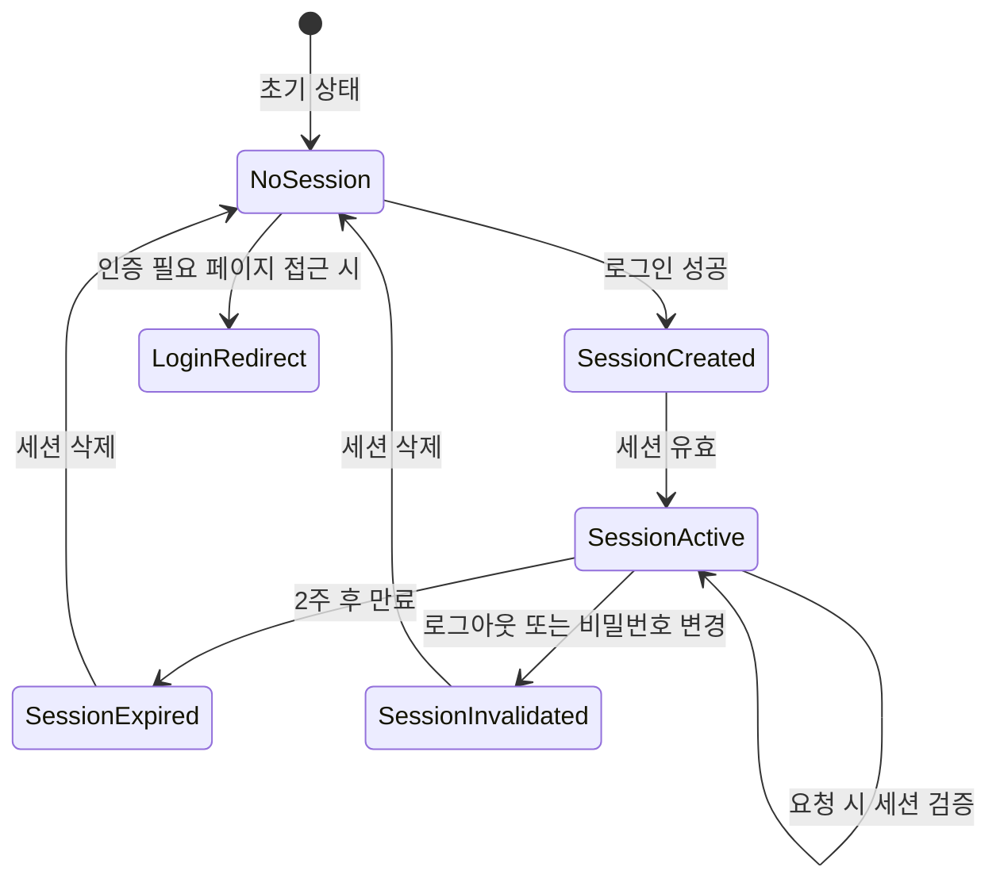

# 상태관리 설계 문서: 로그인/회원가입 페이지
## University Data Visualization Dashboard

---

## 문서 정보
- **작성일**: 2025-11-02
- **버전**: 1.0
- **대상 페이지**: 로그인 (`/login`), 회원가입 (`/signup`)
- **관련 Use Cases**: UC-01 (회원가입), UC-02 (로그인)
- **기술 스택**: Django Templates + Server-side Rendering

---

## 1. 개요

### 1.1 페이지 목적
- **로그인 페이지**: 등록된 사용자의 인증 및 세션 생성
- **회원가입 페이지**: 신규 사용자 등록 및 관리자 승인 대기

### 1.2 상태관리 전략
Django 세션 기반 서버사이드 렌더링을 사용하므로, **클라이언트 측 상태는 최소화**하고 **서버 측 세션 및 데이터베이스 상태**를 중심으로 관리합니다.

**핵심 원칙:**
- 서버가 진실의 원천 (Single Source of Truth)
- Django 템플릿 컨텍스트로 상태 전달
- 최소한의 JavaScript만 사용 (폼 검증, UX 개선)
- 세션 기반 인증 (MVP 범위)

---

## 2. 상태 데이터 정의

### 2.1 서버 측 상태 (Database + Session)

#### 2.1.1 User 모델 상태 (Database)
```python
# apps/authentication/models.py
class User(models.Model):
    """
    사용자 정보 및 인증 상태
    """
    class Meta:
        db_table = 'users'
        managed = False  # Supabase가 스키마 관리

    # 상태 필드
    id = models.BigAutoField(primary_key=True)
    email = models.EmailField(unique=True)  # 유니크 키
    password = models.CharField(max_length=255)  # PBKDF2 해싱
    name = models.CharField(max_length=100)
    department = models.CharField(max_length=100, null=True, blank=True)
    position = models.CharField(max_length=100, null=True, blank=True)
    role = models.CharField(max_length=20, default='viewer')  # admin/manager/viewer
    status = models.CharField(max_length=20, default='pending')  # pending/active/inactive
    created_at = models.DateTimeField(auto_now_add=True)
    updated_at = models.DateTimeField(auto_now=True)
```

**상태 변화 조건:**
| 필드 | 초기값 | 변경 조건 | 변경 후 값 | 화면 변화 |
|------|--------|----------|-----------|----------|
| `status` | `'pending'` | 회원가입 완료 | `'pending'` | "관리자 승인 대기" 메시지 표시 |
| `status` | `'pending'` | 관리자 승인 | `'active'` | 로그인 가능 상태 |
| `status` | `'pending'` | 관리자 거부 | `'inactive'` | 로그인 불가, "계정 비활성화" 메시지 |
| `password` | (해싱됨) | 로그인 시도 | (변경 없음) | 인증 성공/실패 메시지 |
| `updated_at` | (생성시각) | 로그인 성공 | (현재시각) | 세션 생성, 대시보드 리디렉션 |

---

#### 2.1.2 Django 세션 상태 (Server Session)
```python
# Django session framework (database-backed)
request.session = {
    '_auth_user_id': '123',  # User ID
    '_auth_user_backend': 'django.contrib.auth.backends.ModelBackend',
    '_auth_user_hash': '<hash>',  # 비밀번호 변경 감지
    '_session_expiry': 1209600,  # 2주 (기본값)
}
```

**상태 변화 조건:**
| 상태 | 변경 조건 | 변경 후 | 화면 변화 |
|------|----------|---------|----------|
| 세션 없음 | 로그인 성공 | 세션 생성 | 대시보드 리디렉션, 인증 필요 페이지 접근 가능 |
| 세션 존재 | 로그아웃 | 세션 삭제 | 로그인 페이지 리디렉션, 인증 필요 페이지 접근 불가 |
| 세션 존재 | 세션 만료 (2주) | 세션 삭제 | 자동 로그아웃, 로그인 페이지 리디렉션 |
| 세션 존재 | 비밀번호 변경 | 세션 무효화 | 자동 로그아웃, 재로그인 필요 |

---

### 2.2 클라이언트 측 상태 (Minimal JavaScript)

#### 2.2.1 폼 입력 상태 (Transient State)
```javascript
// 로그인 폼 상태
const loginFormState = {
    email: '',        // 입력된 이메일
    password: '',     // 입력된 비밀번호
    isSubmitting: false,  // 제출 중 여부
    errors: {}        // 필드별 에러 메시지
};

// 회원가입 폼 상태
const signupFormState = {
    email: '',
    password: '',
    passwordConfirm: '',
    name: '',
    department: '',
    position: '',
    isSubmitting: false,
    errors: {}
};
```

**상태 변화 조건:**
| 필드 | 초기값 | 변경 조건 | 변경 후 | 화면 변화 |
|------|--------|----------|---------|----------|
| `email` | `''` | 사용자 입력 | (입력값) | 실시간 이메일 형식 검증 (선택적) |
| `password` | `''` | 사용자 입력 | (입력값) | 비밀번호 강도 표시 (선택적) |
| `isSubmitting` | `false` | 폼 제출 클릭 | `true` | 버튼 비활성화, 로딩 스피너 표시 |
| `isSubmitting` | `true` | 서버 응답 수신 | `false` | 버튼 활성화, 로딩 스피너 숨김 |
| `errors` | `{}` | 서버 검증 실패 | `{email: '...'}` | 필드 아래 에러 메시지 표시, 필드 강조 |

---

#### 2.2.2 UI 상태 (UI-only State)
```javascript
const uiState = {
    isPasswordVisible: false,  // 비밀번호 표시/숨김 토글
    isModalOpen: false,        // 모달 상태 (성공 메시지 등)
    formStep: 1                // 다단계 폼인 경우 (MVP에서는 불필요)
};
```

**상태 변화 조건:**
| 필드 | 초기값 | 변경 조건 | 변경 후 | 화면 변화 |
|------|--------|----------|---------|----------|
| `isPasswordVisible` | `false` | 눈 아이콘 클릭 | `true` | 비밀번호 텍스트 표시 |
| `isPasswordVisible` | `true` | 눈 아이콘 클릭 | `false` | 비밀번호 마스킹 (●●●●) |
| `isModalOpen` | `false` | 회원가입 성공 | `true` | "관리자 승인 대기" 모달 표시 |
| `isModalOpen` | `true` | 모달 확인 버튼 클릭 | `false` | 모달 숨김, 로그인 페이지로 이동 |

---

### 2.3 화면에 보이지만 상태가 아닌 데이터 (Computed/Derived)

#### 2.3.1 계산된 값 (Computed Values)
```python
# Django 템플릿 컨텍스트에서 계산
context = {
    'has_errors': bool(form.errors),  # 에러 존재 여부
    'error_count': len(form.errors),  # 에러 개수
    'is_email_duplicate': 'email' in form.errors and 'unique' in str(form.errors['email']),
    'password_strength': calculate_password_strength(password),  # 선택적
}
```

#### 2.3.2 정적 데이터 (Static Content)
```python
STATIC_CONTENT = {
    'page_title': '로그인' or '회원가입',
    'logo_url': '/static/images/logo.png',
    'help_text': {
        'password': '비밀번호는 최소 4자 이상이어야 합니다.',
        'email': '대학 이메일을 사용하세요.',
    },
    'links': {
        'signup': '/signup',
        'login': '/login',
        'password_reset': '/password-reset',  # 2단계 로드맵
    }
}
```

---

## 3. 상태 변경 플로우 (Flux 패턴)

### 3.1 로그인 플로우



**Flux 패턴 요소:**
- **Action**: 사용자 폼 제출 (`POST /login`)
- **Dispatcher**: Django URL dispatcher (`urls.py`)
- **Store**: User 모델 (Database) + Django Session
- **View**: Django 템플릿 (`login.html`)

---

### 3.2 회원가입 플로우



**Flux 패턴 요소:**
- **Action**: 사용자 폼 제출 (`POST /signup`)
- **Dispatcher**: Django URL dispatcher
- **Store**: User 모델 (Database)
- **View**: Django 템플릿 (`signup.html`)

---

## 4. 에러 상태 관리

### 4.1 서버 측 에러 처리

#### 4.1.1 Django Form Errors
```python
# apps/authentication/forms.py
class LoginForm(forms.Form):
    email = forms.EmailField(
        error_messages={
            'required': '이메일을 입력하세요.',
            'invalid': '올바른 이메일 형식이 아닙니다.',
        }
    )
    password = forms.CharField(
        error_messages={
            'required': '비밀번호를 입력하세요.',
        }
    )

    def clean(self):
        cleaned_data = super().clean()
        email = cleaned_data.get('email')
        password = cleaned_data.get('password')

        if email and password:
            try:
                user = User.objects.get(email=email)
                if not user.check_password(password):
                    raise forms.ValidationError('이메일 또는 비밀번호가 잘못되었습니다.')

                if user.status == 'pending':
                    raise forms.ValidationError('관리자 승인 대기 중입니다.')
                elif user.status == 'inactive':
                    raise forms.ValidationError('계정이 비활성화되었습니다. 관리자에게 문의하세요.')
            except User.DoesNotExist:
                raise forms.ValidationError('이메일 또는 비밀번호가 잘못되었습니다.')

        return cleaned_data
```

#### 4.1.2 에러 상태 타입
```python
ERROR_TYPES = {
    'validation': {  # 검증 에러
        'email_required': '이메일을 입력하세요.',
        'email_invalid': '올바른 이메일 형식이 아닙니다.',
        'email_duplicate': '이미 사용 중인 이메일입니다.',
        'password_required': '비밀번호를 입력하세요.',
        'password_short': '비밀번호는 최소 4자 이상이어야 합니다.',
        'password_mismatch': '비밀번호가 일치하지 않습니다.',
        'field_required': '이 항목은 필수입니다.',
    },
    'authentication': {  # 인증 에러
        'invalid_credentials': '이메일 또는 비밀번호가 잘못되었습니다.',
        'account_pending': '관리자 승인 대기 중입니다.',
        'account_inactive': '계정이 비활성화되었습니다. 관리자에게 문의하세요.',
    },
    'server': {  # 서버 에러
        'database_error': '시스템 오류가 발생했습니다. 잠시 후 다시 시도해주세요.',
        'network_error': '네트워크 오류가 발생했습니다.',
        'csrf_error': 'CSRF 토큰이 유효하지 않습니다. 페이지를 새로고침해주세요.',
    }
}
```

---

### 4.2 클라이언트 측 에러 표시

#### 4.2.1 에러 UI 상태
```javascript
// static/js/auth-form-handler.js
const errorState = {
    hasErrors: false,
    fieldErrors: {
        email: null,
        password: null,
        name: null,
        department: null,
        position: null,
        passwordConfirm: null,
    },
    globalError: null,  // 폼 전체 에러 (인증 실패 등)
};

// 에러 표시 함수
function displayFieldError(fieldName, errorMessage) {
    const field = document.getElementById(fieldName);
    const errorDiv = document.getElementById(`${fieldName}-error`);

    field.classList.add('error');
    errorDiv.textContent = errorMessage;
    errorDiv.style.display = 'block';
}

function clearFieldError(fieldName) {
    const field = document.getElementById(fieldName);
    const errorDiv = document.getElementById(`${fieldName}-error`);

    field.classList.remove('error');
    errorDiv.textContent = '';
    errorDiv.style.display = 'none';
}
```

#### 4.2.2 에러 복구 플로우


---

## 5. 세션 상태 관리

### 5.1 Django 세션 라이프사이클

```python
# config/settings/base.py
SESSION_ENGINE = 'django.contrib.sessions.backends.db'  # DB 기반 세션
SESSION_COOKIE_AGE = 1209600  # 2주 (초 단위)
SESSION_COOKIE_HTTPONLY = True  # JavaScript 접근 차단
SESSION_COOKIE_SECURE = True  # HTTPS only (프로덕션)
SESSION_COOKIE_SAMESITE = 'Lax'  # CSRF 보호
SESSION_SAVE_EVERY_REQUEST = False  # 매 요청마다 세션 저장하지 않음
```

**세션 상태 변화:**


---

### 5.2 세션 검증 미들웨어

```python
# apps/core/middleware.py
class SessionValidationMiddleware:
    """
    모든 요청에서 세션 유효성 검증
    """
    def __init__(self, get_response):
        self.get_response = get_response

    def __call__(self, request):
        # 로그인 필요 없는 경로
        public_paths = ['/login', '/signup', '/static', '/media']

        if not any(request.path.startswith(path) for path in public_paths):
            if not request.user.is_authenticated:
                # 세션 없음: 로그인 페이지로 리디렉션
                return redirect('login')

            if request.user.status != 'active':
                # 비활성 사용자: 로그아웃 후 로그인 페이지로
                logout(request)
                messages.error(request, '계정이 비활성화되었습니다.')
                return redirect('login')

        response = self.get_response(request)
        return response
```

---

## 6. 데이터 캐싱 전략

### 6.1 캐싱 레벨

#### 6.1.1 세션 캐싱 (Django Session Framework)
```python
# 세션은 기본적으로 DB 캐싱됨
# 추가 캐싱 불필요 (MVP 범위)
```

#### 6.1.2 정적 컨텐츠 캐싱
```python
# settings.py
STATICFILES_STORAGE = 'django.contrib.staticfiles.storage.ManifestStaticFilesStorage'

# 브라우저 캐싱 헤더 설정
# Cache-Control: max-age=31536000 (1년)
```

#### 6.1.3 데이터베이스 쿼리 캐싱
```python
# 로그인 시 사용자 조회는 캐싱 불필요 (빈번하지 않음)
# 회원가입 시 이메일 중복 확인도 캐싱 불필요 (항상 최신 데이터 필요)
```

**캐싱 전략 요약:**
- **세션**: Django 세션 프레임워크 (DB 기반)
- **정적 파일**: 브라우저 캐싱 (1년)
- **데이터베이스**: 캐싱 불필요 (MVP 범위)

---

## 7. 폼 입력 검증 전략

### 7.1 2단계 검증 (Client + Server)

```mermaid
flowchart LR
    A[사용자 입력] --> B{클라이언트 검증}
    B -->|실패| C[즉시 에러 표시]
    B -->|성공| D[서버로 제출]
    D --> E{서버 검증}
    E -->|실패| F[에러 메시지와 함께<br/>폼 다시 렌더링]
    E -->|성공| G[성공 처리<br/>(세션 생성 또는<br/>사용자 등록)]
```

---

### 7.2 클라이언트 측 검증 (선택적, UX 개선)

```javascript
// static/js/auth-form-handler.js
const validationRules = {
    email: {
        required: true,
        pattern: /^[^\s@]+@[^\s@]+\.[^\s@]+$/,
        message: '올바른 이메일 형식을 입력하세요.'
    },
    password: {
        required: true,
        minLength: 4,
        message: '비밀번호는 최소 4자 이상이어야 합니다.'
    },
    passwordConfirm: {
        required: true,
        match: 'password',
        message: '비밀번호가 일치하지 않습니다.'
    },
    name: {
        required: true,
        maxLength: 100,
        message: '이름을 입력하세요.'
    }
};

// 실시간 검증 (blur 이벤트)
document.getElementById('email').addEventListener('blur', function() {
    const value = this.value.trim();
    const rule = validationRules.email;

    if (rule.required && !value) {
        displayFieldError('email', '이메일을 입력하세요.');
    } else if (!rule.pattern.test(value)) {
        displayFieldError('email', rule.message);
    } else {
        clearFieldError('email');
    }
});
```

---

### 7.3 서버 측 검증 (필수)

```python
# apps/authentication/forms.py
class SignupForm(forms.ModelForm):
    password_confirm = forms.CharField(widget=forms.PasswordInput)

    class Meta:
        model = User
        fields = ['email', 'password', 'name', 'department', 'position']

    def clean_email(self):
        email = self.cleaned_data['email']
        if User.objects.filter(email=email).exists():
            raise forms.ValidationError('이미 사용 중인 이메일입니다.')
        return email

    def clean_password(self):
        password = self.cleaned_data['password']
        if len(password) < 4:
            raise forms.ValidationError('비밀번호는 최소 4자 이상이어야 합니다.')
        return password

    def clean(self):
        cleaned_data = super().clean()
        password = cleaned_data.get('password')
        password_confirm = cleaned_data.get('password_confirm')

        if password and password_confirm and password != password_confirm:
            raise forms.ValidationError('비밀번호가 일치하지 않습니다.')

        return cleaned_data

    def save(self, commit=True):
        user = super().save(commit=False)
        user.set_password(self.cleaned_data['password'])  # 비밀번호 해싱
        user.status = 'pending'  # 기본 상태
        user.role = 'viewer'  # 기본 역할

        if commit:
            user.save()

        return user
```

---

## 8. 템플릿 컨텍스트 (Django Template Context)

### 8.1 로그인 페이지 컨텍스트

```python
# apps/authentication/views.py
def login_view(request):
    """로그인 페이지 뷰"""
    if request.user.is_authenticated:
        # 이미 로그인된 경우 대시보드로 리디렉션
        return redirect('dashboard')

    if request.method == 'POST':
        form = LoginForm(request.POST)
        if form.is_valid():
            # 인증 성공 처리
            email = form.cleaned_data['email']
            user = User.objects.get(email=email)
            login(request, user)

            # next 파라미터 처리
            next_url = request.GET.get('next', 'dashboard')
            return redirect(next_url)
    else:
        form = LoginForm()

    context = {
        'form': form,
        'page_title': '로그인',
        'show_signup_link': True,
        'show_password_reset_link': False,  # 2단계 로드맵
        'csrf_token': csrf(request)['csrf_token'],
    }

    return render(request, 'authentication/login.html', context)
```

---

### 8.2 회원가입 페이지 컨텍스트

```python
def signup_view(request):
    """회원가입 페이지 뷰"""
    if request.user.is_authenticated:
        return redirect('dashboard')

    if request.method == 'POST':
        form = SignupForm(request.POST)
        if form.is_valid():
            user = form.save()
            messages.success(request, '회원가입이 완료되었습니다. 관리자 승인 후 로그인 가능합니다.')
            return redirect('login')
    else:
        form = SignupForm()

    context = {
        'form': form,
        'page_title': '회원가입',
        'show_login_link': True,
        'csrf_token': csrf(request)['csrf_token'],
        'departments': get_department_choices(),  # 학과 선택 옵션
        'positions': get_position_choices(),      # 직책 선택 옵션
    }

    return render(request, 'authentication/signup.html', context)
```

---

## 9. JavaScript 상태 관리 (선택적)

### 9.1 최소한의 JavaScript 상태

```javascript
// static/js/auth-form-handler.js
/**
 * 인증 폼 핸들러 (로그인, 회원가입)
 */
class AuthFormHandler {
    constructor(formId) {
        this.form = document.getElementById(formId);
        this.submitButton = this.form.querySelector('button[type="submit"]');
        this.isSubmitting = false;

        this.init();
    }

    init() {
        // 폼 제출 이벤트 리스너
        this.form.addEventListener('submit', this.handleSubmit.bind(this));

        // 실시간 검증 (선택적)
        this.addRealtimeValidation();

        // 비밀번호 표시/숨김 토글
        this.setupPasswordToggle();
    }

    handleSubmit(e) {
        if (this.isSubmitting) {
            e.preventDefault();
            return;
        }

        // 클라이언트 검증
        if (!this.validateForm()) {
            e.preventDefault();
            return;
        }

        // 제출 상태 설정
        this.isSubmitting = true;
        this.submitButton.disabled = true;
        this.submitButton.textContent = '처리 중...';

        // 서버로 제출 (기본 동작)
    }

    validateForm() {
        let isValid = true;

        // 각 필드 검증
        const fields = this.form.querySelectorAll('input[required]');
        fields.forEach(field => {
            if (!this.validateField(field)) {
                isValid = false;
            }
        });

        return isValid;
    }

    validateField(field) {
        const value = field.value.trim();
        const fieldName = field.name;

        // 필수 항목 검증
        if (!value) {
            this.showFieldError(field, '이 항목은 필수입니다.');
            return false;
        }

        // 필드별 검증
        switch(fieldName) {
            case 'email':
                return this.validateEmail(field, value);
            case 'password':
                return this.validatePassword(field, value);
            case 'password_confirm':
                return this.validatePasswordConfirm(field, value);
            default:
                this.clearFieldError(field);
                return true;
        }
    }

    validateEmail(field, value) {
        const pattern = /^[^\s@]+@[^\s@]+\.[^\s@]+$/;
        if (!pattern.test(value)) {
            this.showFieldError(field, '올바른 이메일 형식을 입력하세요.');
            return false;
        }
        this.clearFieldError(field);
        return true;
    }

    validatePassword(field, value) {
        if (value.length < 4) {
            this.showFieldError(field, '비밀번호는 최소 4자 이상이어야 합니다.');
            return false;
        }
        this.clearFieldError(field);
        return true;
    }

    validatePasswordConfirm(field, value) {
        const password = this.form.querySelector('input[name="password"]').value;
        if (value !== password) {
            this.showFieldError(field, '비밀번호가 일치하지 않습니다.');
            return false;
        }
        this.clearFieldError(field);
        return true;
    }

    showFieldError(field, message) {
        const errorDiv = document.getElementById(`${field.name}-error`);
        if (errorDiv) {
            errorDiv.textContent = message;
            errorDiv.style.display = 'block';
            field.classList.add('error');
        }
    }

    clearFieldError(field) {
        const errorDiv = document.getElementById(`${field.name}-error`);
        if (errorDiv) {
            errorDiv.textContent = '';
            errorDiv.style.display = 'none';
            field.classList.remove('error');
        }
    }

    addRealtimeValidation() {
        const fields = this.form.querySelectorAll('input[required]');
        fields.forEach(field => {
            field.addEventListener('blur', () => {
                this.validateField(field);
            });

            // 에러가 있는 필드는 입력 시 재검증
            field.addEventListener('input', () => {
                if (field.classList.contains('error')) {
                    this.validateField(field);
                }
            });
        });
    }

    setupPasswordToggle() {
        const toggleButtons = this.form.querySelectorAll('.password-toggle');
        toggleButtons.forEach(button => {
            button.addEventListener('click', (e) => {
                e.preventDefault();
                const input = button.previousElementSibling;
                const type = input.type === 'password' ? 'text' : 'password';
                input.type = type;

                // 아이콘 변경
                const icon = button.querySelector('i');
                icon.classList.toggle('fa-eye');
                icon.classList.toggle('fa-eye-slash');
            });
        });
    }
}

// 페이지 로드 시 초기화
document.addEventListener('DOMContentLoaded', function() {
    const loginForm = document.getElementById('login-form');
    if (loginForm) {
        new AuthFormHandler('login-form');
    }

    const signupForm = document.getElementById('signup-form');
    if (signupForm) {
        new AuthFormHandler('signup-form');
    }
});
```

---

## 10. 템플릿 구조

### 10.1 로그인 페이지 템플릿

```django
{# templates/authentication/login.html #}



{{ page_title }}


<div class="auth-container">
    <div class="auth-card">
        <h1 class="auth-title">{{ page_title }}</h1>

        {# 전역 에러 메시지 #}
        
            <div class="alert alert-error">
                {{ form.non_field_errors }}
            </div>
        

        {# Django 메시지 프레임워크 #}
        
            
                <div class="alert alert-{{ message.tags }}">
                    {{ message }}
                </div>
            
        

        <form id="login-form" method="post" action="">
            

            {# 이메일 필드 #}
            <div class="form-group">
                <label for="email">이메일</label>
                <input
                    type="email"
                    id="email"
                    name="email"
                    value="{{ form.email.value|default:'' }}"
                    required
                    class="error"
                    placeholder="your-email@university.ac.kr"
                >
                <div id="email-error" class="field-error" style="display: none;"></div>
                
                    <div class="field-error">{{ form.email.errors.0 }}</div>
                
            </div>

            {# 비밀번호 필드 #}
            <div class="form-group">
                <label for="password">비밀번호</label>
                <div class="password-input-wrapper">
                    <input
                        type="password"
                        id="password"
                        name="password"
                        required
                        class="error"
                        placeholder="비밀번호를 입력하세요"
                    >
                    <button type="button" class="password-toggle" aria-label="비밀번호 표시/숨김">
                        <i class="fa fa-eye"></i>
                    </button>
                </div>
                <div id="password-error" class="field-error" style="display: none;"></div>
                
                    <div class="field-error">{{ form.password.errors.0 }}</div>
                
            </div>

            {# 제출 버튼 #}
            <button type="submit" class="btn btn-primary btn-block">
                로그인
            </button>
        </form>

        {# 링크 #}
        <div class="auth-links">
            
                <a href="">회원가입</a>
            
            
                <a href="">비밀번호 찾기</a>
            
        </div>
    </div>
</div>



<script src=""></script>

```

---

### 10.2 회원가입 페이지 템플릿

```django
{# templates/authentication/signup.html #}



{{ page_title }}


<div class="auth-container">
    <div class="auth-card">
        <h1 class="auth-title">{{ page_title }}</h1>

        {# 전역 에러 메시지 #}
        
            <div class="alert alert-error">
                {{ form.non_field_errors }}
            </div>
        

        <form id="signup-form" method="post" action="">
            

            {# 이메일 필드 #}
            <div class="form-group">
                <label for="email">이메일 *</label>
                <input
                    type="email"
                    id="email"
                    name="email"
                    value="{{ form.email.value|default:'' }}"
                    required
                    class="error"
                >
                <div id="email-error" class="field-error"></div>
                
                    <div class="field-error">{{ form.email.errors.0 }}</div>
                
            </div>

            {# 비밀번호 필드 #}
            <div class="form-group">
                <label for="password">비밀번호 *</label>
                <div class="password-input-wrapper">
                    <input
                        type="password"
                        id="password"
                        name="password"
                        required
                        class="error"
                    >
                    <button type="button" class="password-toggle">
                        <i class="fa fa-eye"></i>
                    </button>
                </div>
                <small class="help-text">최소 4자 이상</small>
                <div id="password-error" class="field-error"></div>
                
                    <div class="field-error">{{ form.password.errors.0 }}</div>
                
            </div>

            {# 비밀번호 확인 필드 #}
            <div class="form-group">
                <label for="password_confirm">비밀번호 확인 *</label>
                <div class="password-input-wrapper">
                    <input
                        type="password"
                        id="password_confirm"
                        name="password_confirm"
                        required
                        class="error"
                    >
                    <button type="button" class="password-toggle">
                        <i class="fa fa-eye"></i>
                    </button>
                </div>
                <div id="password_confirm-error" class="field-error"></div>
                
                    <div class="field-error">{{ form.password_confirm.errors.0 }}</div>
                
            </div>

            {# 이름 필드 #}
            <div class="form-group">
                <label for="name">이름 *</label>
                <input
                    type="text"
                    id="name"
                    name="name"
                    value="{{ form.name.value|default:'' }}"
                    required
                    maxlength="100"
                    class="error"
                >
                <div id="name-error" class="field-error"></div>
                
                    <div class="field-error">{{ form.name.errors.0 }}</div>
                
            </div>

            {# 소속 부서 필드 #}
            <div class="form-group">
                <label for="department">소속 학과</label>
                <select id="department" name="department" class="error">
                    <option value="">선택하세요</option>
                    
                        <option value="{{ dept }}" selected>
                            {{ dept }}
                        </option>
                    
                </select>
                <div id="department-error" class="field-error"></div>
                
                    <div class="field-error">{{ form.department.errors.0 }}</div>
                
            </div>

            {# 직책 필드 #}
            <div class="form-group">
                <label for="position">직책</label>
                <select id="position" name="position" class="error">
                    <option value="">선택하세요</option>
                    
                        <option value="{{ pos }}" selected>
                            {{ pos }}
                        </option>
                    
                </select>
                <div id="position-error" class="field-error"></div>
                
                    <div class="field-error">{{ form.position.errors.0 }}</div>
                
            </div>

            {# 제출 버튼 #}
            <button type="submit" class="btn btn-primary btn-block">
                회원가입
            </button>
        </form>

        {# 링크 #}
        <div class="auth-links">
            
                <span>이미 계정이 있으신가요? <a href="">로그인</a></span>
            
        </div>
    </div>
</div>



<script src=""></script>

```

---

## 11. 성능 최적화

### 11.1 데이터베이스 쿼리 최적화

```python
# 이메일로 사용자 조회 시 인덱스 활용
# users 테이블의 email 컬럼에 UNIQUE INDEX 존재
User.objects.get(email=email)  # O(1) 복잡도

# 세션 조회 최적화
# django_session 테이블의 session_key에 PRIMARY KEY 인덱스
Session.objects.get(session_key=session_key)
```

---

### 11.2 프론트엔드 최적화

```javascript
// 디바운싱: 실시간 검증 시 과도한 호출 방지
function debounce(func, delay) {
    let timeoutId;
    return function(...args) {
        clearTimeout(timeoutId);
        timeoutId = setTimeout(() => func.apply(this, args), delay);
    };
}

const debouncedValidation = debounce(validateField, 300);
```

---

### 11.3 렌더링 성능

```css
/* CSS 애니메이션 하드웨어 가속 */
.auth-card {
    transform: translateZ(0);
    will-change: transform;
}

/* 에러 메시지 트랜지션 */
.field-error {
    transition: opacity 0.2s ease-in-out;
}
```

---

## 12. 보안 고려사항

### 12.1 CSRF 보호

```python
# Django 기본 CSRF 미들웨어 사용
MIDDLEWARE = [
    'django.middleware.csrf.CsrfViewMiddleware',
    # ...
]

# 템플릿에서 CSRF 토큰 포함

```

---

### 12.2 비밀번호 보안

```python
# settings.py
PASSWORD_HASHERS = [
    'django.contrib.auth.hashers.PBKDF2PasswordHasher',  # 기본
    'django.contrib.auth.hashers.PBKDF2SHA1PasswordHasher',
    'django.contrib.auth.hashers.Argon2PasswordHasher',
    'django.contrib.auth.hashers.BCryptSHA256PasswordHasher',
]

# 최소 비밀번호 길이
AUTH_PASSWORD_VALIDATORS = [
    {
        'NAME': 'django.contrib.auth.password_validation.MinimumLengthValidator',
        'OPTIONS': {'min_length': 4}  # MVP: 4자 (프로덕션: 8자 이상 권장)
    },
]
```

---

### 12.3 세션 보안

```python
# settings.py
SESSION_COOKIE_HTTPONLY = True  # XSS 공격 방지
SESSION_COOKIE_SECURE = True  # HTTPS only
SESSION_COOKIE_SAMESITE = 'Lax'  # CSRF 보호
CSRF_COOKIE_HTTPONLY = True
CSRF_COOKIE_SECURE = True
```

---

## 13. 테스트 전략

### 13.1 단위 테스트

```python
# tests/test_authentication.py
class SignupViewTest(TestCase):
    def test_valid_signup(self):
        """유효한 회원가입 데이터 테스트"""
        data = {
            'email': 'test@university.ac.kr',
            'password': '1234',
            'password_confirm': '1234',
            'name': '테스트 사용자',
            'department': '컴퓨터공학과',
            'position': '교수',
        }
        response = self.client.post(reverse('signup'), data)

        self.assertEqual(response.status_code, 302)  # 리디렉션
        self.assertTrue(User.objects.filter(email='test@university.ac.kr').exists())
        user = User.objects.get(email='test@university.ac.kr')
        self.assertEqual(user.status, 'pending')
        self.assertEqual(user.role, 'viewer')

    def test_duplicate_email_signup(self):
        """이메일 중복 회원가입 테스트"""
        # 기존 사용자 생성
        User.objects.create_user(
            email='test@university.ac.kr',
            password='1234',
            name='기존 사용자'
        )

        data = {
            'email': 'test@university.ac.kr',
            'password': '5678',
            'password_confirm': '5678',
            'name': '신규 사용자',
        }
        response = self.client.post(reverse('signup'), data)

        self.assertEqual(response.status_code, 200)  # 폼 재렌더링
        self.assertFormError(response, 'form', 'email', '이미 사용 중인 이메일입니다.')

class LoginViewTest(TestCase):
    def setUp(self):
        self.user = User.objects.create_user(
            email='test@university.ac.kr',
            password='1234',
            name='테스트',
            status='active'
        )

    def test_valid_login(self):
        """유효한 로그인 테스트"""
        data = {
            'email': 'test@university.ac.kr',
            'password': '1234',
        }
        response = self.client.post(reverse('login'), data)

        self.assertEqual(response.status_code, 302)
        self.assertRedirects(response, reverse('dashboard'))
        self.assertTrue(response.wsgi_request.user.is_authenticated)

    def test_pending_user_login(self):
        """승인 대기 사용자 로그인 테스트"""
        self.user.status = 'pending'
        self.user.save()

        data = {
            'email': 'test@university.ac.kr',
            'password': '1234',
        }
        response = self.client.post(reverse('login'), data)

        self.assertEqual(response.status_code, 200)
        self.assertContains(response, '관리자 승인 대기 중입니다')
        self.assertFalse(response.wsgi_request.user.is_authenticated)
```

---

### 13.2 통합 테스트

```python
class AuthenticationFlowTest(TestCase):
    def test_full_signup_and_login_flow(self):
        """회원가입 → 승인 → 로그인 전체 플로우 테스트"""
        # 1. 회원가입
        signup_data = {
            'email': 'newuser@university.ac.kr',
            'password': 'test1234',
            'password_confirm': 'test1234',
            'name': '신규 사용자',
            'department': '컴퓨터공학과',
        }
        signup_response = self.client.post(reverse('signup'), signup_data)
        self.assertEqual(signup_response.status_code, 302)

        user = User.objects.get(email='newuser@university.ac.kr')
        self.assertEqual(user.status, 'pending')

        # 2. 로그인 시도 (승인 전 - 실패)
        login_response = self.client.post(reverse('login'), {
            'email': 'newuser@university.ac.kr',
            'password': 'test1234',
        })
        self.assertEqual(login_response.status_code, 200)
        self.assertContains(login_response, '승인 대기')

        # 3. 관리자 승인
        user.status = 'active'
        user.save()

        # 4. 로그인 시도 (승인 후 - 성공)
        login_response = self.client.post(reverse('login'), {
            'email': 'newuser@university.ac.kr',
            'password': 'test1234',
        })
        self.assertRedirects(login_response, reverse('dashboard'))
```

---

## 14. 변경 이력

| 버전 | 날짜 | 변경 내용 | 작성자 |
|------|------|-----------|--------|
| 1.0 | 2025-11-02 | 초안 작성<br>- 서버 측 상태 정의 (User 모델, Django 세션)<br>- 클라이언트 측 상태 정의 (폼 입력, UI 상태)<br>- Flux 패턴 플로우 (로그인, 회원가입)<br>- 에러 상태 관리<br>- 세션 라이프사이클<br>- 폼 검증 전략 (2단계)<br>- 템플릿 구조 및 JavaScript 예제<br>- 보안 고려사항<br>- 테스트 전략 | Claude Code |

---

## 15. 참고 문서

- [UC-01: 회원가입](/Users/seunghyun/Test/vmc6/docs/usecases/01-signup/spec.md)
- [UC-02: 로그인](/Users/seunghyun/Test/vmc6/docs/usecases/02-login/spec.md)
- [PRD](/Users/seunghyun/Test/vmc6/docs/prd.md)
- [User Flow](/Users/seunghyun/Test/vmc6/docs/userflow.md)
- [Database Schema](/Users/seunghyun/Test/vmc6/docs/database.md)
- [Common Modules](/Users/seunghyun/Test/vmc6/docs/common-modules.md)

---

**문서 작성 완료**
**다음 작업**: 대시보드 페이지 상태관리 설계
