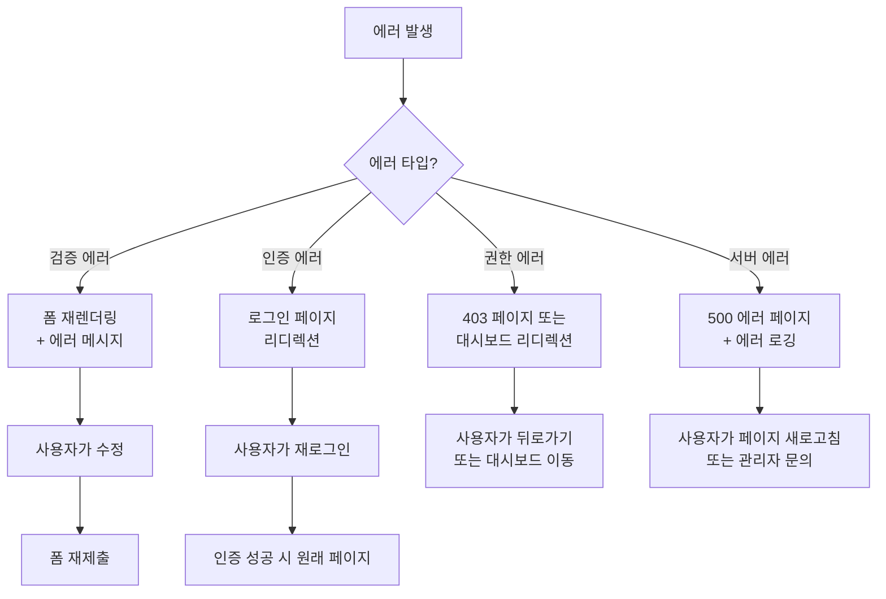

# 상태관리 설계 전체 개요
## University Data Visualization Dashboard

---

## 문서 정보
- **작성일**: 2025-11-02
- **버전**: 1.0
- **프로젝트**: Django + Server-side Rendering
- **인증 방식**: Django Session-based Authentication (MVP)

---

## 1. 상태관리 철학 및 전략

### 1.1 Django MVP 프로젝트의 상태관리 원칙

이 프로젝트는 **Django 템플릿 기반 서버사이드 렌더링**을 사용하므로, 전통적인 SPA(Single Page Application)와는 다른 상태관리 접근 방식이 필요합니다.

**핵심 원칙:**
1. **서버가 진실의 원천 (Single Source of Truth)**
   - 모든 상태는 서버(Database + Session)에서 관리
   - Django 템플릿 컨텍스트를 통해 상태 전달
   - 클라이언트 측 상태는 최소화

2. **최소한의 JavaScript 사용**
   - 폼 검증 및 UX 개선에만 JavaScript 사용
   - Context + useReducer 대신 Django Form + Session 사용
   - Chart.js는 시각화 라이브러리로만 활용

3. **Django의 내장 기능 최대 활용**
   - Django Session Framework
   - Django Form Validation
   - Django Messages Framework
   - Django ORM Query Optimization

---

### 1.2 상태 계층 구조

```
┌─────────────────────────────────────────────────────────────┐
│                     Database (PostgreSQL)                    │
│                  - User, KPI, Publications, etc.             │
│                  (Persistent State - Single Source of Truth) │
└─────────────────────────────────────────────────────────────┘
                              ▲
                              │
                              │ Django ORM
                              │
┌─────────────────────────────────────────────────────────────┐
│                      Django Session                          │
│         - Authentication State (_auth_user_id)               │
│         - Flash Messages (django.contrib.messages)           │
│         - Filter Preferences (선택적)                         │
│                  (Server-side Session State)                 │
└─────────────────────────────────────────────────────────────┘
                              ▲
                              │
                              │ Template Context
                              │
┌─────────────────────────────────────────────────────────────┐
│                  Django Template Context                     │
│         - form, user, request, page_data, etc.               │
│                  (Transient State per Request)               │
└─────────────────────────────────────────────────────────────┘
                              ▲
                              │
                              │ Render
                              │
┌─────────────────────────────────────────────────────────────┐
│              Client-side JavaScript (Minimal)                │
│         - Form Input State (Transient)                       │
│         - UI State (Modal, Toggle, etc.)                     │
│         - Chart.js State (Canvas Rendering)                  │
│                  (Client-side Ephemeral State)               │
└─────────────────────────────────────────────────────────────┘
```

---

## 2. 페이지별 상태관리 전략 요약

### 2.1 인증 페이지 (로그인/회원가입)

| 상태 유형 | 위치 | 설명 |
|----------|------|------|
| **User 모델** | Database | 이메일, 비밀번호(해싱), status(pending/active/inactive), role |
| **Django Session** | Server Session | 인증 후 세션 생성 (`_auth_user_id`, sessionid 쿠키) |
| **폼 입력 상태** | Client JS (Transient) | email, password, name 등 실시간 검증 |
| **UI 상태** | Client JS | isPasswordVisible, isSubmitting, errors |

**상태 플로우:**
```
사용자 입력 → 클라이언트 검증 → POST /login → Django View 검증
→ User 조회 (DB) → status 확인 → 세션 생성 → 대시보드 리디렉션
```

**상세 문서:** [01-auth/state.md](./01-auth/state.md)

---

### 2.2 대시보드 페이지

| 상태 유형 | 위치 | 설명 |
|----------|------|------|
| **KPI 집계 데이터** | Database Query | 최근 연도 KPI, 논문 수, 학생 수, 연구비 집행률 |
| **필터 상태** | Django Session (선택적) | 선택된 연도, 학과 필터 |
| **권한별 데이터** | Django View | role에 따라 전체 또는 소속 학과 데이터만 조회 |
| **Chart.js 렌더링** | Client Canvas | 차트 렌더링 상태 (한 번 렌더링 후 변경 없음) |

**상태 플로우:**
```
GET /dashboard → 세션 검증 → role 확인 → 권한별 데이터 조회
→ KPI 집계 (Aggregator) → Chart.js 데이터 직렬화 → 템플릿 렌더링
→ 클라이언트에서 Chart.js 초기화
```

**상세 문서:** [04-dashboard/state.md](./04-dashboard/state.md) (작성 예정)

---

### 2.3 시각화 페이지 (KPI, 논문, 연구비, 학생)

| 상태 유형 | 위치 | 설명 |
|----------|------|------|
| **필터 상태** | URL Query Params | `?year=2025&department=컴퓨터공학과` |
| **데이터 조회 결과** | Database Query | 필터 조건에 맞는 데이터 조회 |
| **집계 데이터** | Django View | 통계 계산 (평균, 총합, 증감률 등) |
| **Chart.js 데이터** | Template Context | 직렬화된 차트 데이터 |
| **테이블 정렬/페이지** | URL Query Params | `?sort=name&page=2` |

**상태 플로우:**
```
GET /analytics/publications?year=2025&department=컴공
→ 세션 검증 → 필터 파라미터 파싱 → 권한별 데이터 범위 확인
→ QuerySet 필터링 → 집계 (Aggregator) → 직렬화 (Serializer)
→ 템플릿 렌더링 → Chart.js 초기화
```

**필터 변경 시:**
```
사용자가 필터 변경 → JavaScript가 URL 업데이트 → 페이지 리로드
→ 새로운 필터로 데이터 조회 → 재렌더링
```

**상세 문서:**
- [05-department-kpi/state.md](./05-department-kpi/state.md) (작성 예정)
- [06-publications/state.md](./06-publications/state.md) (작성 예정)
- [07-research-budget/state.md](./07-research-budget/state.md) (작성 예정)
- [08-students/state.md](./08-students/state.md) (작성 예정)

---

### 2.4 관리자 페이지 (사용자 승인/거부)

| 상태 유형 | 위치 | 설명 |
|----------|------|------|
| **User 목록** | Database Query | status='pending' 사용자 목록 조회 |
| **승인/거부 액션** | POST /admin/users/approve | User.status 업데이트 (active/inactive) |
| **관리 로그** | Database | 승인자, 승인일시, 거부 사유 기록 |

**상태 플로우:**
```
GET /admin → role='admin' 검증 → pending 사용자 조회 → 템플릿 렌더링
→ 관리자가 승인/거부 버튼 클릭 → POST /admin/users/approve
→ User.status 업데이트 → 성공 메시지 → 페이지 리로드
```

**상세 문서:** [09-user-approval/state.md](./09-user-approval/state.md) (작성 예정)

---

### 2.5 프로필 관리 페이지

| 상태 유형 | 위치 | 설명 |
|----------|------|------|
| **현재 사용자 정보** | Database | request.user 정보 조회 |
| **폼 입력 상태** | Django Form | 이름, 부서, 직책 수정 폼 |
| **비밀번호 변경** | Django Form | 현재 비밀번호, 새 비밀번호 검증 |

**상태 플로우:**
```
GET /profile → 세션 검증 → request.user 조회 → 폼 초기화
→ 템플릿 렌더링 → 사용자가 수정 → POST /profile
→ 폼 검증 → User 업데이트 → 성공 메시지 → 페이지 리로드
```

**상세 문서:** [10-profile-management/state.md](./10-profile-management/state.md) (작성 예정)

---

### 2.6 데이터 업로드 이력 페이지

| 상태 유형 | 위치 | 설명 |
|----------|------|------|
| **업로드 이력 목록** | Database Query | upload_history 테이블 조회 (권한별 필터링) |
| **필터 상태** | URL Query Params | `?data_type=publication&status=success` |
| **페이지네이션** | URL Query Params | `?page=2&page_size=20` |

**상태 플로우:**
```
GET /data/history?data_type=publication&page=2
→ 세션 검증 → 권한 확인 (viewer는 본인 이력만, admin은 전체)
→ UploadHistory 조회 → 필터링 → 페이지네이션
→ 통계 계산 → 템플릿 렌더링
```

**상세 문서:** [12-upload-history/state.md](./12-upload-history/state.md) (작성 예정)

---

## 3. 공통 상태관리 패턴

### 3.1 권한 기반 데이터 접근 (Role-based Access Control)

모든 페이지에서 사용자 역할에 따라 데이터 접근 범위를 제한합니다.

```python
# apps/authentication/permissions.py
def get_accessible_departments(user):
    """
    사용자가 접근 가능한 학과 목록 반환
    """
    if user.role in ['admin', 'manager']:
        return Department.objects.all()
    else:
        return Department.objects.filter(name=user.department)

# 뷰에서 사용
def analytics_view(request):
    departments = get_accessible_departments(request.user)
    data = Publication.objects.filter(department__in=departments)
    # ...
```

**적용 페이지:** 대시보드, 모든 시각화 페이지, 업로드 이력

---

### 3.2 필터 상태 관리 (URL Query Parameters)

필터 상태는 URL 쿼리 파라미터로 관리하여 **브라우저 뒤로가기/공유 가능**하도록 합니다.

```python
# Django View
def publications_view(request):
    # URL 쿼리 파라미터에서 필터 추출
    year = request.GET.get('year', None)
    department = request.GET.get('department', None)
    journal_grade = request.GET.get('journal_grade', None)

    # QuerySet 필터링
    queryset = Publication.objects.all()
    if year:
        queryset = queryset.filter(publication_date__year=year)
    if department:
        queryset = queryset.filter(department=department)
    if journal_grade:
        queryset = queryset.filter(journal_grade=journal_grade)

    # 템플릿 컨텍스트
    context = {
        'publications': queryset,
        'filters': {
            'year': year,
            'department': department,
            'journal_grade': journal_grade,
        }
    }
    return render(request, 'analytics/publications.html', context)
```

```javascript
// JavaScript로 필터 변경 시 URL 업데이트
function updateFilter(filterName, filterValue) {
    const url = new URL(window.location);
    url.searchParams.set(filterName, filterValue);
    window.location.href = url.toString();  // 페이지 리로드
}

// 필터 초기화
function clearFilters() {
    window.location.href = window.location.pathname;
}
```

**적용 페이지:** 모든 시각화 페이지, 업로드 이력

---

### 3.3 Django Messages Framework (일회성 메시지)

성공/에러 메시지는 Django Messages Framework를 사용하여 세션에 일시 저장합니다.

```python
# Django View
from django.contrib import messages

def profile_update_view(request):
    if request.method == 'POST':
        form = ProfileUpdateForm(request.POST, instance=request.user)
        if form.is_valid():
            form.save()
            messages.success(request, '프로필이 성공적으로 업데이트되었습니다.')
            return redirect('profile')
        else:
            messages.error(request, '입력 정보를 확인해주세요.')

    # ...
```

```django
{# 템플릿에서 메시지 표시 #}

    
        <div class="alert alert-{{ message.tags }}">
            {{ message }}
        </div>
    

```

**메시지 타입:**
- `messages.success()`: 성공 메시지 (녹색)
- `messages.error()`: 에러 메시지 (빨간색)
- `messages.warning()`: 경고 메시지 (노란색)
- `messages.info()`: 정보 메시지 (파란색)

**적용 페이지:** 모든 페이지

---

### 3.4 Chart.js 상태 관리

Chart.js는 클라이언트 측 렌더링 라이브러리이므로, 서버에서 **데이터만 전달**하고 클라이언트에서 차트를 렌더링합니다.

```python
# Django View
from apps.analytics.serializers import to_bar_chart_data

def publications_view(request):
    # 데이터 조회 및 집계
    data = Publication.objects.values('department').annotate(
        count=Count('id')
    ).order_by('-count')

    # Chart.js 형식으로 직렬화
    chart_data = to_bar_chart_data(data, 'department', 'count')

    context = {
        'chart_data': chart_data,  # JSON 직렬화
    }
    return render(request, 'analytics/publications.html', context)
```

```django
{# 템플릿 #}
<canvas id="publicationsChart"></canvas>

<script>
    const chartData = {{ chart_data|safe }};  {# JSON 전달 #}

    const ctx = document.getElementById('publicationsChart').getContext('2d');
    new Chart(ctx, {
        type: 'bar',
        data: chartData,
        options: {
            responsive: true,
            // ...
        }
    });
</script>
```

**Chart.js 상태:**
- **Server**: 데이터 조회, 집계, 직렬화
- **Client**: 차트 렌더링, 인터랙션 (툴팁, 줌 등)
- **상태 변경**: 필터 변경 시 서버에서 새로운 데이터 조회 → 페이지 리로드 → 차트 재렌더링

**적용 페이지:** 대시보드, 모든 시각화 페이지

---

### 3.5 폼 상태 관리 (Django Forms)

폼 상태는 Django Forms를 사용하여 서버 측에서 관리합니다.

```python
# Django Form
class ProfileUpdateForm(forms.ModelForm):
    class Meta:
        model = User
        fields = ['name', 'department', 'position']

    def clean_name(self):
        name = self.cleaned_data['name']
        if len(name) < 2:
            raise forms.ValidationError('이름은 최소 2자 이상이어야 합니다.')
        return name

# Django View
def profile_update_view(request):
    if request.method == 'POST':
        form = ProfileUpdateForm(request.POST, instance=request.user)
        if form.is_valid():
            form.save()
            messages.success(request, '프로필이 업데이트되었습니다.')
            return redirect('profile')
    else:
        form = ProfileUpdateForm(instance=request.user)

    context = {'form': form}
    return render(request, 'profile/update.html', context)
```

```django
{# 템플릿 #}
<form method="post">
    
    {{ form.as_p }}  {# 또는 수동으로 필드 렌더링 #}
    <button type="submit">저장</button>
</form>
```

**폼 상태:**
- **초기값**: `instance=request.user` (기존 데이터)
- **입력값**: `request.POST` (사용자 입력)
- **검증**: `form.is_valid()` (서버 측 검증)
- **에러**: `form.errors` (필드별 에러 메시지)

**적용 페이지:** 로그인, 회원가입, 프로필 관리

---

## 4. 상태 변경 플로우 (Flux 패턴 유사)

Django 템플릿 기반 프로젝트에서도 Flux 패턴과 유사한 단방향 데이터 흐름이 적용됩니다.

```
┌─────────────┐
│   Action    │  사용자 이벤트 (클릭, 폼 제출 등)
└──────┬──────┘
       │
       ▼
┌─────────────┐
│ Dispatcher  │  Django URL Router (urls.py)
└──────┬──────┘
       │
       ▼
┌─────────────┐
│    View     │  Django View 함수 (views.py)
│  (Handler)  │  - 권한 확인
│             │  - 데이터 조회/변경
│             │  - 비즈니스 로직
└──────┬──────┘
       │
       ▼
┌─────────────┐
│    Store    │  Database + Session
│ (Database)  │  - User, KPI, Publications 등
└──────┬──────┘
       │
       ▼
┌─────────────┐
│    View     │  Django Template 렌더링
│ (Template)  │  - context 전달
│             │  - HTML 생성
└──────┬──────┘
       │
       ▼
┌─────────────┐
│   Client    │  브라우저에서 HTML 렌더링
│  (Browser)  │  - Chart.js 초기화
│             │  - 최소한의 JavaScript
└─────────────┘
```

**예시: 논문 필터링**
```
1. Action: 사용자가 "2025년" 필터 선택
2. Dispatcher: JavaScript가 URL 업데이트 (/analytics/publications?year=2025)
3. View Handler: publications_view(request) 호출
   - 필터 파라미터 추출 (year=2025)
   - QuerySet 필터링 (Publication.objects.filter(publication_date__year=2025))
   - 집계 (Aggregator)
   - 직렬화 (Serializer)
4. Store: Database 조회 (SELECT * FROM publications WHERE EXTRACT(YEAR FROM publication_date) = 2025)
5. View (Template): publications.html 렌더링
   - context = {'publications': queryset, 'chart_data': chart_data, 'filters': {...}}
6. Client: 브라우저에서 HTML 렌더링 + Chart.js 초기화
```

---

## 5. 에러 상태 관리

### 5.1 에러 타입별 처리 전략

| 에러 타입 | 위치 | 처리 방법 |
|----------|------|----------|
| **검증 에러** | Django Form | `form.errors` → 템플릿에서 필드별 표시 |
| **인증 에러** | Django View | `messages.error()` → 로그인 페이지 리디렉션 |
| **권한 에러** | Django Decorator | `@role_required` → 403 페이지 또는 대시보드 리디렉션 |
| **데이터 없음** | Django View | 빈 QuerySet → "데이터 없음" 메시지 표시 |
| **서버 에러** | Django Middleware | 500 에러 페이지 + 에러 로깅 |
| **네트워크 에러** | Client JS | 타임아웃 처리 + 재시도 안내 |

---

### 5.2 에러 복구 플로우



---

## 6. 성능 최적화

### 6.1 데이터베이스 쿼리 최적화

```python
# Bad: N+1 쿼리 문제
publications = Publication.objects.all()
for pub in publications:
    print(pub.department.name)  # 각 논문마다 DB 쿼리 발생

# Good: select_related로 JOIN
publications = Publication.objects.select_related('department').all()
for pub in publications:
    print(pub.department.name)  # 한 번의 쿼리로 해결

# Good: prefetch_related로 관련 객체 미리 조회
projects = ResearchProject.objects.prefetch_related('execution_records').all()
for project in projects:
    for record in project.execution_records.all():
        print(record.amount)  # 추가 쿼리 없음
```

---

### 6.2 템플릿 캐싱

```python
# settings.py
TEMPLATES = [
    {
        'BACKEND': 'django.template.backends.django.DjangoTemplates',
        'OPTIONS': {
            'loaders': [
                ('django.template.loaders.cached.Loader', [
                    'django.template.loaders.filesystem.Loader',
                    'django.template.loaders.app_directories.Loader',
                ]),
            ],
        },
    },
]
```

---

### 6.3 정적 파일 캐싱

```python
# settings/production.py
STATICFILES_STORAGE = 'django.contrib.staticfiles.storage.ManifestStaticFilesStorage'

# 브라우저 캐싱 헤더
# Cache-Control: max-age=31536000 (1년)
```

---

## 7. 보안 고려사항

### 7.1 Django 기본 보안 기능 활용

```python
# settings/production.py
# CSRF 보호
CSRF_COOKIE_HTTPONLY = True
CSRF_COOKIE_SECURE = True  # HTTPS only

# 세션 보안
SESSION_COOKIE_HTTPONLY = True
SESSION_COOKIE_SECURE = True
SESSION_COOKIE_SAMESITE = 'Lax'

# XSS 방지
# Django 템플릿은 기본적으로 HTML 이스케이프 처리

# SQL Injection 방지
# Django ORM 사용 시 자동 방어

# Clickjacking 방지
X_FRAME_OPTIONS = 'DENY'

# HTTPS 강제
SECURE_SSL_REDIRECT = True
SECURE_HSTS_SECONDS = 31536000
```

---

## 8. 테스트 전략

### 8.1 테스트 레벨

| 테스트 레벨 | 대상 | 도구 |
|------------|------|------|
| **단위 테스트** | Django View, Form, Model | Django TestCase |
| **통합 테스트** | 전체 플로우 (로그인 → 데이터 조회 → 렌더링) | Django TestCase |
| **E2E 테스트** | 브라우저 시뮬레이션 (선택적) | Selenium, Playwright |
| **성능 테스트** | 쿼리 성능, 페이지 로딩 시간 | django-debug-toolbar, pytest-benchmark |

---

### 8.2 테스트 예시

```python
# tests/test_dashboard.py
class DashboardViewTest(TestCase):
    def setUp(self):
        self.user = User.objects.create_user(
            email='test@university.ac.kr',
            password='1234',
            status='active',
            role='viewer',
            department='컴퓨터공학과'
        )
        self.client.login(email='test@university.ac.kr', password='1234')

    def test_dashboard_access(self):
        """대시보드 접근 테스트"""
        response = self.client.get(reverse('dashboard'))
        self.assertEqual(response.status_code, 200)
        self.assertTemplateUsed(response, 'dashboard/index.html')

    def test_dashboard_kpi_data(self):
        """대시보드 KPI 데이터 표시 테스트"""
        # 테스트 데이터 생성
        DepartmentKPI.objects.create(
            evaluation_year=2025,
            college='공과대학',
            department='컴퓨터공학과',
            employment_rate=88.0,
            full_time_faculty=17,
        )

        response = self.client.get(reverse('dashboard'))
        self.assertContains(response, '88.0')  # 취업률 표시 확인
        self.assertContains(response, '17')    # 교원 수 표시 확인

    def test_dashboard_role_based_access(self):
        """권한별 데이터 접근 테스트"""
        # viewer는 소속 학과 데이터만 조회 가능
        response = self.client.get(reverse('dashboard'))
        context = response.context

        # 소속 학과 데이터만 표시되는지 확인
        self.assertEqual(context['accessible_departments'], ['컴퓨터공학과'])
```

---

## 9. 페이지별 상태관리 설계 문서 목록

| 페이지 | 문서 경로 | 상태 |
|--------|----------|------|
| **로그인/회원가입** | [01-auth/state.md](./01-auth/state.md) | ✅ 완료 |
| **대시보드** | [04-dashboard/state.md](./04-dashboard/state.md) | 작성 예정 |
| **학과별 KPI 시각화** | [05-department-kpi/state.md](./05-department-kpi/state.md) | 작성 예정 |
| **논문 게재 시각화** | [06-publications/state.md](./06-publications/state.md) | 작성 예정 |
| **연구비 집행 시각화** | [07-research-budget/state.md](./07-research-budget/state.md) | 작성 예정 |
| **학생 데이터 시각화** | [08-students/state.md](./08-students/state.md) | 작성 예정 |
| **사용자 승인/거부** | [09-user-approval/state.md](./09-user-approval/state.md) | 작성 예정 |
| **프로필 관리** | [10-profile-management/state.md](./10-profile-management/state.md) | 작성 예정 |
| **데이터 업로드 이력** | [12-upload-history/state.md](./12-upload-history/state.md) | 작성 예정 |

---

## 10. 개발 가이드라인

### 10.1 새로운 페이지 추가 시 체크리스트

- [ ] **상태 정의**: 어떤 상태가 필요한지 명시 (Database, Session, Client)
- [ ] **권한 확인**: `@login_required`, `@role_required` 데코레이터 적용
- [ ] **필터 상태**: URL Query Parameters로 관리
- [ ] **에러 처리**: Django Messages Framework 사용
- [ ] **폼 검증**: Django Forms 사용 (서버 측 검증 필수)
- [ ] **Chart.js 데이터**: Serializer로 직렬화
- [ ] **테스트 작성**: 단위 테스트 및 통합 테스트

---

### 10.2 상태관리 안티패턴 (피해야 할 것)

❌ **클라이언트 측에 상태 저장**
```javascript
// Bad: 클라이언트 측에 데이터 저장
const publications = [/* 논문 데이터 */];
localStorage.setItem('publications', JSON.stringify(publications));
```

✅ **서버 측에서 데이터 조회**
```python
# Good: 항상 서버에서 최신 데이터 조회
def publications_view(request):
    publications = Publication.objects.all()
    # ...
```

---

❌ **JavaScript로 복잡한 상태 관리**
```javascript
// Bad: 클라이언트에서 필터링 및 집계
const filteredData = publications.filter(p => p.year === 2025);
const aggregated = /* 복잡한 집계 로직 */;
```

✅ **Django에서 데이터 처리**
```python
# Good: 서버에서 필터링 및 집계
publications = Publication.objects.filter(publication_date__year=2025)
aggregated = publications.aggregate(count=Count('id'), avg_if=Avg('impact_factor'))
```

---

❌ **세션에 대용량 데이터 저장**
```python
# Bad: 세션에 QuerySet 저장
request.session['all_publications'] = list(Publication.objects.all().values())
```

✅ **필요한 것만 세션에 저장**
```python
# Good: 필터 조건만 세션에 저장 (선택적)
request.session['filter_year'] = 2025
# 데이터는 매번 DB에서 조회
```

---

## 11. 변경 이력

| 버전 | 날짜 | 변경 내용 | 작성자 |
|------|------|-----------|--------|
| 1.0 | 2025-11-02 | 초안 작성<br>- 상태관리 철학 및 전략<br>- 페이지별 상태관리 요약<br>- 공통 패턴 (권한, 필터, 메시지, Chart.js, 폼)<br>- Flux 패턴 유사 플로우<br>- 에러 관리, 성능 최적화, 보안, 테스트<br>- 개발 가이드라인 | Claude Code |

---

## 12. 참고 문서

- [Use Cases Summary](/Users/seunghyun/Test/vmc6/docs/usecases/SUMMARY.md)
- [User Flow](/Users/seunghyun/Test/vmc6/docs/userflow.md)
- [Database Schema](/Users/seunghyun/Test/vmc6/docs/database.md)
- [Common Modules](/Users/seunghyun/Test/vmc6/docs/common-modules.md)
- [PRD](/Users/seunghyun/Test/vmc6/docs/prd.md)

---

**문서 작성 완료**
**다음 작업**: 각 페이지별 상세 상태관리 설계 문서 작성
